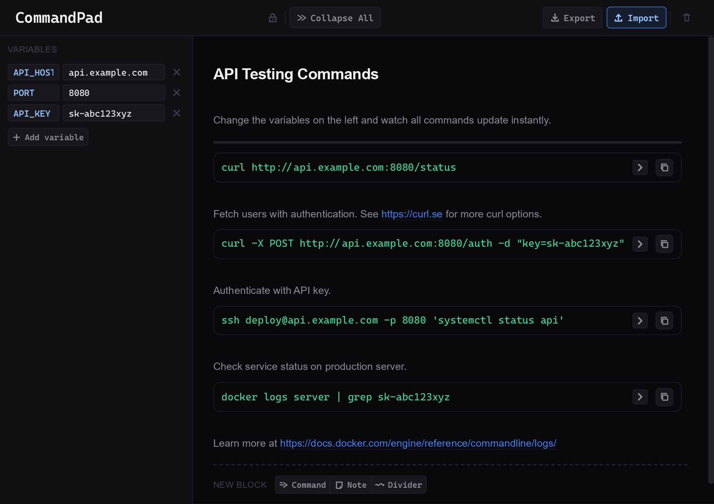

# CommandPad

A lightweight, variable-aware command runbook tool. Define variables once, reference them across any number of command blocks, and copy fully resolved commands instantly. Designed for engineers who run the same sequences of commands repeatedly with different environments, credentials, or targets.



---

## Table of Contents

- [Features](#features)
- [Quick Start](#quick-start)
  - [Requirements](#requirements)
  - [Run Locally](#run-locally)
- [Usage](#usage)
  - [Runbook Library](#runbook-library)
  - [Variables](#variables)
  - [Block Types](#block-types)
  - [Multi-select](#multi-select)
  - [Read Mode](#read-mode)
  - [Export](#export)
- [Keyboard Shortcuts](#keyboard-shortcuts)
- [Examples](#examples)
- [Contributing](#contributing)
- [License](#license)

---

## Features

- **Runbook library**: import one or many `.json` runbooks into a persistent sidebar list. Click any entry to switch the active workspace instantly — no re-importing.
- **Variables**: define named variables and reference them in any other variable or command block.
- **Live resolved preview**: every command block shows the fully resolved command.
- **Three block types**: commands, notes, and dividers can be mixed freely to build structured, annotated runbooks.
- **Rich note blocks**: notes support three text styles (heading, subheading, body), auto-detect URLs, and support inline markdown: `**bold**`, `_italic_`, `` `code` ``.
- **Drag-and-drop reordering**: blocks, variables, and runbook library entries can each be reordered independently via their drag handles.
- **Multi-block selection**: hold `Ctrl` and click or lasso-drag across blocks to build a selection. Move, duplicate, or delete the whole group at once.
- **Read mode**: locks the entire interface against structural edits, while still allowing variable values to change and runbooks to be switched.
- **Persistent state**: workspace, sidebar state, app mode, and the runbook library are all saved locally and restored on reload.
- **Export**: save the active workspace to a `.json` file, with a native OS save dialog on supported browsers.

---

## Quick Start

### Requirements

- Any modern browser (Chrome, Firefox, Edge, Safari).
- No server required.

---

### Run Locally

**Option A. Open directly:**

Double-click `index.html` to open it in your default browser.

---

**Option B. Use a VS Code extension (recommended):**

1. Install the **Live Server** extension (`ritwickdey.liveserver`), listed in [.vscode/extensions.json](.vscode/extensions.json).
2. Open the Command Palette (`Ctrl+Shift+P`) and run **Live Server: Open with Live Server**.

Use **Live Server: Stop Live Server** to stop.

---

## Usage

### Runbook Library

The sidebar's top section holds your imported runbooks.

- Click **Import** under the Runbooks section to import one or more `.json` files at once.
- Click any runbook entry to make it the active workspace. The current variables and blocks are replaced with that runbook's content.
- Delete a runbook from the library with the button that appears on row hover.
- Drag the handle on the left of an entry to reorder the library list.

If a runbook's first block is a note, its text is used as the library label, so you can tell runbooks apart at a glance. Otherwise it falls back to the imported filename.

---

### Variables

Variables are defined in the Variables section of the sidebar. Each variable has a **key** and a **value**.

- Click **New** to create a new one.
- Keys are case-sensitive.
- Variables with empty keys are ignored.
- Delete a variable with the button that appears on row hover.
- Drag the handle on the left to reorder variables.
- Variables can reference other variables: `URL=https://{HOST}/api`.
- Renaming a key propagates the change to all command blocks and other variable values automatically.
- Hovering over a key or value input shows the full content in a tooltip.

Reference a variable in any command block:

```plain
{VARIABLE_NAME}
```

---

### Block Types

Blocks are the main content of a runbook. Add them using the **NEW BLOCK** row at the bottom of the main panel.

---

#### Command Block

A command block has two parts:

- **Preview** (always visible): the resolved command. Click **Copy** to copy the resolved text to the clipboard.
- **Editor** (collapsible): the raw template prefixed with `$`. Collapse it with the chevron button in the preview row, or toggle all editors globally from the header. Commands can span multiple lines. If a line exceeds the panel width, the editor scrolls horizontally.

---

#### Note Block

A free-form text block. Three styles are selectable on hover:

| Style        | Appearance       |
| ------------ | ---------------- |
| `heading`    | Large, bold      |
| `subheading` | Medium, accented |
| `body`       | Default prose    |

Supports inline markdown:

| Syntax        | Result         |
| ------------- | -------------- |
| `**text**`    | **Bold**       |
| `_text_`      | _Italic_       |
| `` `text` ``  | `Code pill`    |
| `https://...` | Clickable link |

To open a link, hold `Alt` and click it.

Note blocks auto-expand horizontally and vertically as you type.

---

#### Divider Block

A visual separator line. Stretches to match the width of the widest block. Useful for separating runbook sections.

---

### Multi-select

Hold `Ctrl` and click blocks to build a selection. You can also hold `Ctrl` and hold down the mouse button while moving the cursor across blocks (lasso select). Hold `Ctrl` over already-selected blocks and lasso to deselect them.

With a selection active:

- **Drag** any selected block's handle to move all selected blocks together, preserving their relative order.
- **Duplicate** any selected block to duplicate the entire group, inserted after the last selected block.
- **Delete** any selected block to delete the entire group.
- Press `Escape` or click anywhere outside block controls to clear the selection.

While `Ctrl` is held, the interface is in selection-only mode.

---

### Read Mode

Read mode locks editing, not navigation.

Click the **padlock icon** in the header to enter read mode:

- All command editors are collapsed and cannot be expanded.
- Note and command block text cannot be edited.
- Block structure, variables and runbooks cannot be changed (no adding, deleting, or reordering).
- Note style pickers are hidden.
- Links in notes are directly clickable.

Click the **pencil icon** to return to edit mode. The mode is saved across page reloads.

---

### Export

Click the **Export** button in the header to save the active workspace. A native OS save dialog opens on supported browsers so you can choose the filename and folder; otherwise the file downloads directly.

---

## Keyboard Shortcuts

| Shortcut                          | Action                                         |
| --------------------------------- | ---------------------------------------------- |
| `Ctrl+E`                          | Toggle Read mode / Edit mode                   |
| `Ctrl+G`                          | Toggle all command editors (collapse / expand) |
| `Ctrl+I`                          | Open the runbook import dialog                 |
| `Ctrl+S`                          | Collapse / expand the sidebar                  |
| `Ctrl+D`                          | Duplicate selected blocks                      |
| `Del`                             | Delete selected blocks                         |
| `Escape`                          | Clear block selection                          |
| `Ctrl+Shift+E`                    | Export the active workspace                    |
| `Ctrl+Shift+Backspace`            | Clear all variables, blocks, and runbooks      |
| `Alt` + **click** on a note link  | Open the link in a new tab                     |
| `Ctrl` + **click/drag** on blocks | Multi-select blocks                            |

---

## Examples

Browse the [docs/examples/](/docs/examples/) folder for sample runbooks.

---

## Contributing

Contributions are welcome. Suggested workflow:

1. Fork the repository.
2. Create a feature branch: `feat/my-change`.
3. Make your changes following the existing code style.
4. Include appropriate documentation or tests.
5. Commit, push, and open a pull request describing the change and the reason for it.

---

## License

This project is available under the **MIT License**.
