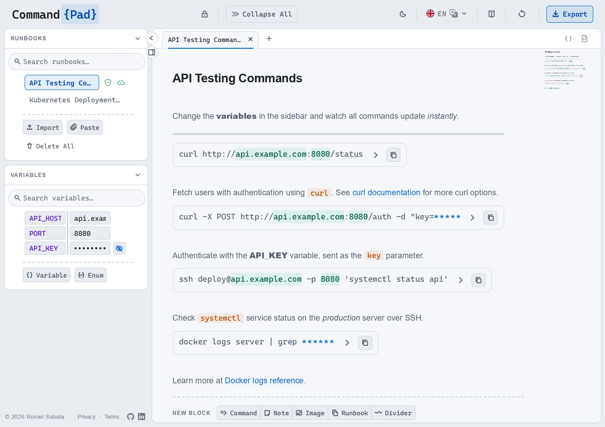

# CommandPad

A runbook editor for the commands you run again and again. Write your hosts, environments and credentials once as variables, use them in every command, and copy each command already filled in. It runs entirely in your browser.



---

## Table of Contents

- [Motivation](#motivation)
- [Features](#features)
- [Documentation](#documentation)
- [Quick Start](#quick-start)
  - [Requirements](#requirements)
  - [Installation](#installation)
  - [Run Locally](#run-locally)
  - [Run Tests](#run-tests)
- [Cloud Sync (Optional)](#cloud-sync-optional)
  - [OneDrive](#onedrive)
  - [Google Drive](#google-drive)
- [Examples](#examples)
- [Contributing](#contributing)
- [License](#license)

---

## Motivation

Most engineers keep their operational commands somewhere: a text file, a wiki page, a pile of shell history. Running one means copying it and hand-editing the hostname, the namespace, the ticket number or the credentials before pressing Enter, and that last-second edit is where mistakes happen, like a command meant for staging run against production.

CommandPad turns those notes into **runbooks**. Each value is written down once as a variable, every command references it by name, and what you copy is the finished command, already filled in. Switching environment means changing a value, not rewriting every line.

It is also deliberately **local-first**: there is no backend and no account. Everything runs in the browser and stays on your machine unless you choose to export it or sync it to your own cloud storage.

---

## Features

- **Variables**: define a value once and reference it as `{NAME}` in any command, or inside another variable.
- **Live resolved preview**: every command shows the fully resolved result as you type, ready to copy in one click.
- **Inline transforms**: adjust a value where you use it, such as `{BRANCH|kebabcase}`, `{DATE|slice(;4)}` or `{|calc({MINUTES} * 60)}`.
- **Mixed blocks**: combine commands, markdown notes, images, dividers and embedded runbooks into one annotated procedure.
- **Secrets**: masked on screen and encrypted at rest with a passphrase of your choice.
- **Runbook library and tabs**: keep many runbooks and work on several at once.
- **Import and export**: JSON, Markdown or plain text, with optional sync to OneDrive or Google Drive.

---

## Documentation

Full usage documentation lives **inside the app**: click the book icon in the header, or open `/docs` directly. It covers every concept with live, interactive examples.

---

## Quick Start

### Requirements

- [Node.js](https://nodejs.org)
- [pnpm](https://pnpm.io)
- [Visual Studio Code](https://code.visualstudio.com) (Recommended)

---

### Installation

```bash
pnpm install
```

---

### Run Locally

```bash
pnpm dev
```

Access at `http://localhost:5173`. Use <kbd>Ctrl</kbd>+<kbd>C</kbd> to stop.

---

### Run Tests

```bash
pnpm test
```

Re-run the affected tests on every save:

```bash
pnpm test:watch
```

The suite covers the **variable engine**: reference resolution, template placeholders, operations, and key renames. It is pure logic run under [Vitest](https://vitest.dev) with no DOM, so there are no browser or UI tests.

Tests sit next to the code they cover and share the helpers in [src/test/](/src/test/).

---

## Cloud Sync (Optional)

CommandPad can export/import runbooks straight to OneDrive or Google Drive, in addition to the local device. Both are entirely optional: the app works normally with neither configured, and a provider only appears as a destination option once it's set up below.

Runbooks are stored as flat files inside a dedicated `CommandPad` folder in the signed-in account's own storage.

### OneDrive

1. In the [Azure Portal](https://portal.azure.com), go to **Microsoft Entra ID > App registrations > New registration**.
2. Set the **Redirect URI** platform to **Single-page application (SPA)** and its value to the URL CommandPad is served from (e.g. `http://localhost:5173`).
3. Under **API permissions**, add the delegated permissions **User.Read** and **Files.ReadWrite.AppFolder** (no admin consent is normally required for these).
4. Copy the **Application (client) ID** from the app's Overview page.
5. Set `VITE_MSAL_CLIENT_ID` to that value in a `.env.local` file (copy `.env.example` as a starting point), then rebuild.

---

### Google Drive

1. In the [Google Cloud Console](https://console.cloud.google.com), create (or pick) a project, then open **APIs & Services > OAuth consent screen** and configure it.
2. Go to **Credentials > Create Credentials > OAuth client ID**, choose **Web application**, and add the URL CommandPad is served from under **Authorized JavaScript origins**.
3. Copy the generated **Client ID**.
4. Set `VITE_GOOGLE_CLIENT_ID` to that value in a `.env.local` file, then rebuild.

---

## Examples

Browse the [docs/examples/](/docs/examples/) folder for sample runbooks.

---

## Contributing

Contributions are welcome. Suggested workflow:

1. Fork the repository.
2. Create a feature branch: `feat/my-change`.
3. Make your changes following the existing code style.
4. Include appropriate documentation or tests.
5. Commit, push, and open a pull request describing the change and the reason for it.

### Pre-commit Hooks <!-- omit in toc -->

This project uses [pre-commit](https://pre-commit.com/) to enforce code quality checks before each commit. Run once from the **repo root** to set it up:

```bash
pip install pre-commit
pre-commit install
```

Checks run automatically on every `git commit`. To run them manually:

```bash
pre-commit run --all-files
```

---

## License

This project is available under the **MIT License**.
